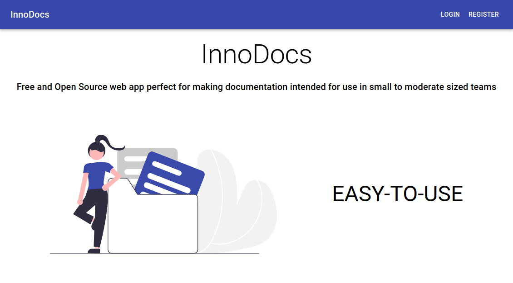
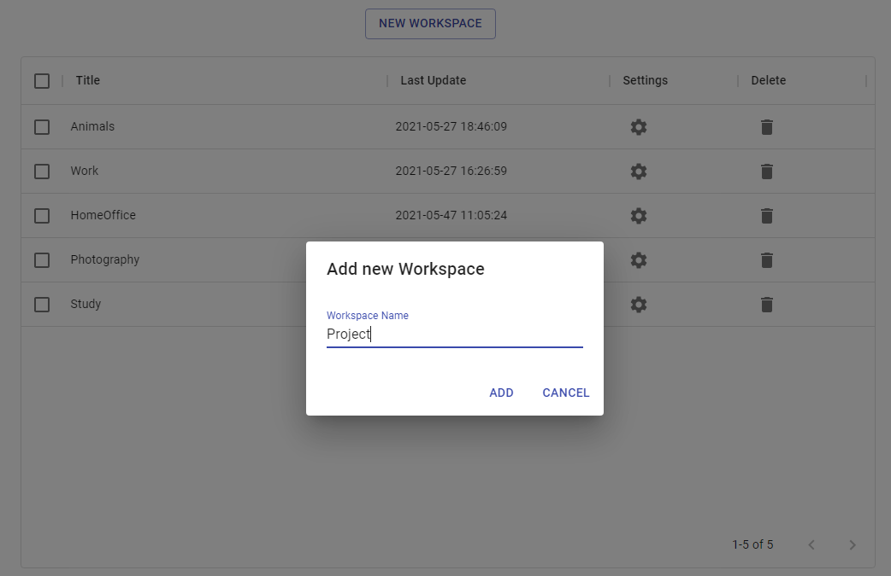
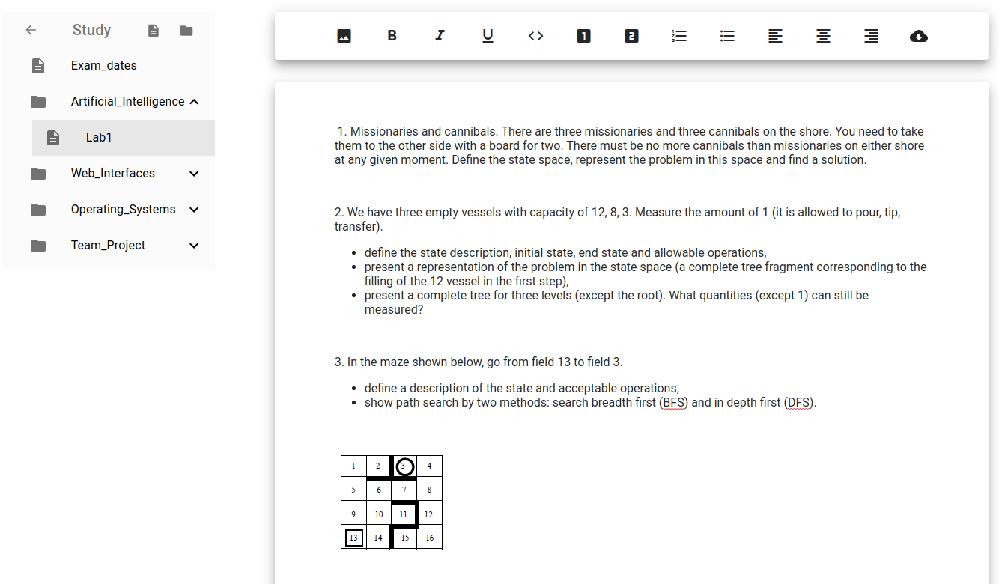
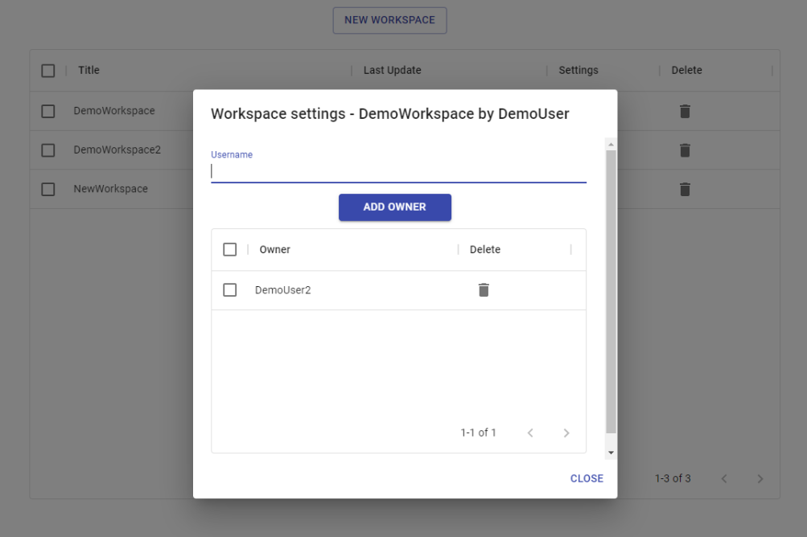

# InnoDocs

<!-- TABLE OF CONTENTS -->
## Table of contents
  <ol>
    <li><a href="#about-the-project">About The Project</a></li>
    <li><a href="#usage">Usage</a></li>
    <li><a href="#technologies">Technologies</a></li>
    <li>
      <a href="#getting-started">Getting started</a>
      <ul>
        <li><a href="#prerequisites">Prerequisites</a></li>
        <li><a href="#installation">Installation</a></li>
      </ul>
    </li>
    <li><a href="#contributing">Contributing</a></li>
    <li><a href="#license">License</a></li>
  </ol>

<!-- GENERAL INFO -->
## About the project

The goal of this project is to crerate the knowledge base application intended for use in a small to moderate sized teams. The app was created for several reasons:
* No simple document management application in the market (e.g. Confluence)
* For many apps you have to pay (e.g. Documize)
* Some apps have a non-intuitive user experience (e.g. Notion)

<!-- USAGE EXAMPLES -->
## Usage

The project is available to everyone at [https://innodocs.tech](https://innodocs.tech).

Main functionalities of the application:
* create a workspace with multiple folders and files

* create and edit a document

* publish a workspace for selected users to access

* export a document to pdf file

<!-- TECHNOLOGIES -->
## Technologies
  <ul>
    <li>
      Backend
      <ul>
        <li>Python 3.9</li>
        <li>FastAPI</li>
 <!--   <li><a href="#">TODO</a></li> -->
      </ul>
    </li>
    <li>
      Frontend
      <ul>
        <li>React</li>
        <li>TypeScript</li>
      </ul>
    </li>
  </ul>

<!-- START -->
## Getting Started

TODO

### Prerequisites

TODO

### Installation

TODO

<!-- AUTHORS -->
## Contributing

Students:

* [Paweł Fedorczak](https://github.com/pfedorczak98)
* [Dominik Kurowski](https://github.com/d-kurowski)
* [Radosław Łodziński](https://github.com/Radekowicz)
* [Filip Przygoński](https://github.com/FilipJQ77)
* [Filip Sołdon](https://github.com/Fohin) 
* [Jakub Tołściuk](https://github.com/Workata)

InnovativeProject - Nokia Supervisors:

* Ewa Kaczmarek
* Michał Polański
* Aleksander Uniatowicz

<!-- LICENSE -->
# License

Distributed under the MIT License. See [LICENSE](LICENSE) for more information.

Wrocław 2021